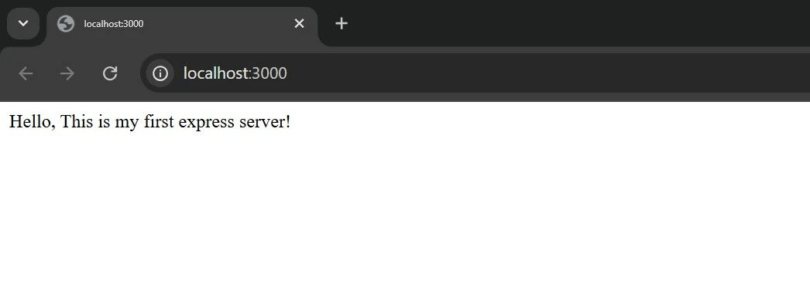

# The simplest way to create a backend server using Node.js + Express

## 📚 Table of Contents

- [x] to config express
- [x] express() → creates server
- [x] app.get() → creates route (API Route)
- [x] app.listen() → starts server
- [x] PORT → server runs on this port


---
## Create a Simple Backend Server (Step-by-Step)

### 1. Create a Simple Backend Server (Step-by-Step)

#### Step 1: Install Node.js
Download and install from:

👉 https://nodejs.org

After installing, check:

```bash
node -v
npm -v
```

#### Step 2: Create a Project Folder
```bash
mkdir class_01
cd class_01
```

Initialize project:
```bash
npm init -y
```
This creates a package.json file.


#### Step 3: Install Express
Express is a minimal backend framework for Node.js.
```bash
npm i express or npm install express
```


#### Step 4: Create a Server File
Create a server.js file:
```bash
touch server.js
```

Now, add the following code to the server.js file:

```javascript
const express = require('express');
const app = express();
const port = 3000;

app.listen(port, () => {
  console.log(`Server running on port ${port}`);
});
```

---
#### Step 5: Run the Server
```bash
node server.js
```

Now, open your browser and navigate to http://localhost:3000


## Output



Install nodemon (auto restart server)
```bash
npm install nodemon --save-dev
```

Add this in package.json:

```json
"scripts": {
  "start": "nodemon server.js"
}
```

Run the server:
```bash
npm start
```

Now, open your browser and navigate to http://localhost:3000

Now server restarts automatically when you save changes.

---

If nodemon is not working, try this:

```bash
npm install -D tsx
npx tsx watch server.js
```

And add this in package.json
---
```json
"scripts": {
  "dev": "tsx watch server.js"
}
```

Run the server: 
```bash
npm run dev
```

Now, open your browser and navigate to http://localhost:3000

Now server restarts automatically when you save changes.

---
This script is alternative of nodemon to run the server automatically.

---
Go to next class for further reading.

class_02 link here: [class_02](./class_02_crud_operation.md)

class_03 link here: [class_03](./class_03_crud_with_status_code.md)

Documentation link here:
[View All Docs](../Documents/)